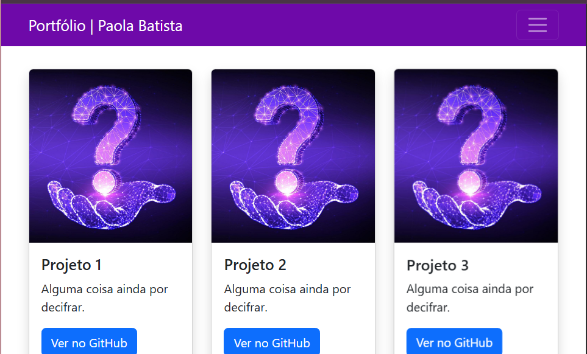
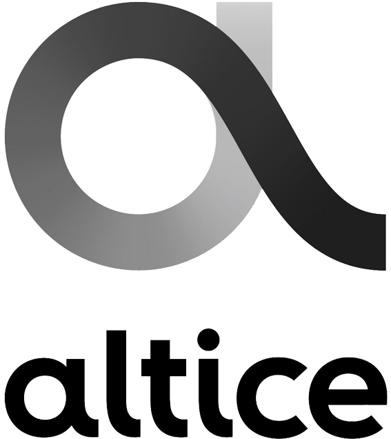
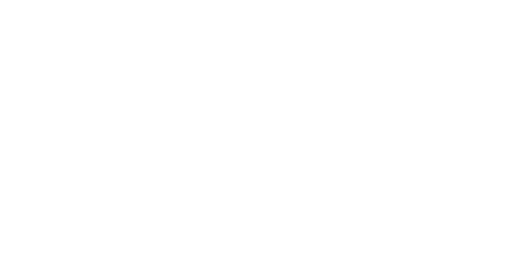

# Portfólio Pessoal - Paola Batista

Este é um template de portfólio pessoal desenvolvido com HTML, CSS e JavaScript, sem dependências de frameworks ou bibliotecas externas. O objetivo é criar um portfólio simples, limpo e moderno para apresentar seus projetos e experiências.

## Demonstração

[Link para a demonstração do portfólio](https://paolaolibatista.github.io/paola_batista_tpsi/portfolio/)

## Estrutura do Projeto

```
portfolio-template/
├── index.html        # Arquivo principal HTML
├── index.css         # Arquivo de estilos CSS
├── index.js          # Arquivo JavaScript (se necessário)
├── images/           # Pasta para imagens e outros assets
│   ├── favicon.png   # Ícone do site
│   ├── header.jpg    # Imagem de fundo do cabeçalho
│   ├── me2.jpg       # Foto pessoal
│   ├── protoport.png # Imagem do projeto "Generic Portfolio prototype"
│   ├── quiz.png      # Imagem do projeto "Quiz Time"
│   ├── death_note.png# Imagem do projeto "Website"
│   ├── github.svg    # Ícone do GitHub
│   ├── linkedin.svg  # Ícone do LinkedIn
│   ├── arrow-up.svg  # Ícone de seta para cima
│   ├── ATEC_logo-removebg-preview.png # Logo ATEC
│   ├── pngimg.com - mcdonalds_PNG21.png # Logo McDonalds
│   ├── ATC.AS_BIG.png # Logo Altice
│   ├── volkswagen-group-services-logo-png_seeklogo-478134.png # Logo Volkswagen
│   └── CSCO.D.png # Logo Cisco
└── README.md         # Este arquivo
```

## Funcionalidades

- Design de UI Limpo, Simples e Moderno.
- Sem dependências de frameworks ou bibliotecas CSS/JavaScript.
- Construído apenas com HTML, CSS e JavaScript.
- Documentação bem organizada.
- Fácil de personalizar.

## Como Usar

1.  Clone este repositório:

    ```bash
    git clone https://github.com/paolaolibatista/portfolio-template.git
    ```

2.  Abra o arquivo `index.html` no seu editor de código.

3.  Edite as informações nas seções indicadas com comentários HTML.

### Edição do Conteúdo

No arquivo `index.html`, você encontrará comentários HTML indicando onde você deve inserir suas informações. Substitua os textos e links de acordo com seu perfil e projetos.

#### Cabeçalho

```html
<header class="header" role="banner" id="top">
    <div class="row">
      <nav class="nav" role="navigation">
        <ul class="nav__items">
          <li class="nav__item"><a href="#work" class="nav__link">My Projects</a></li>
          <li class="nav__item"><a href="#clients" class="nav__link">Experience</a></li>
          <li class="nav__item">
            <a href="#about" class="nav__link">About</a>
          </li>
          <li class="nav__item">
            <a href="#contact" class="nav__link">Contact</a>
          </li>
        </ul>
      </nav>
    </div>
    <div class="header__text-box row">
      <div class="header__text">
        <h1 class="heading-primary">
          <!-- Replace the following name with your name -->
          <span>Paola Batista</span>
        </h1>
        <!-- Put a small paragraph about yourself -->
        <p>A aspiring Web Developer based in Setúbal, Portugal.</p>
        <a href="#contact" class="btn btn--pink">Get in touch</a>
      </div>
    </div>
  </header>
```

#### Projetos

```html
<section class="work" id="work">
      <div class="row">
        <h2>My Projects</h2>
        <div class="work__boxes">

          <!-- Each div with the work__box class is a project. -->

          <div class="work__box">
            <div class="work__text">
              <h3>Generic Portfolio prototype</h3>
              <p>
                A beginner easy to make portfolio.
              </p>
              <ul class="work__list">
                <li>HTML</li>
                <li>JavaScript</li>
              </ul>

              <div class="work__links">
                <a href="https://github.com/paolaolibatista/paola_batista_tpsi/tree/main/portfolio" target="_blank" class="link__text">
                  Visit Site <span>&rarr;</span>
                </a>
                <a href="https://github.com/paolaolibatista/paola_batista_tpsi/tree/main" title="View Source Code" target="_blank">
                  
                </a>
              </div>
            </div>
            <div class="work__image-box">
              
            </div>
          </div>
```

#### Experiência

```html
   <section class="client" id="clients">
  <div class="row">
    <h2>Experience</h2>
    <div class="client__logos">
      <a href="https://www.atec.pt/" target="_blank">
        
      </a>
      <a href="https://www.mcdonalds.pt/" target="_blank">
        
      </a>
      <a href="https://altice.net/" target="_blank">
        
      </a>
      <a href="https://www.volkswagen-groupservices.pt/" target="_blank">
        
      </a>
      <a href="https://www.netacad.com/" target="_blank">
        
      </a>
    </div>
  </div>
</section>
```

#### Sobre Mim

```html
 <section class="about" id="about">
      <div class="row">
        <h2>About Me</h2>
        <div class="about__content">
          <div class="about__text">
            <!-- Replace the below paragraph with info about yourself -->
            <p>
              I’m a programming student with hands-on experience in e-commerce management, customer service, and quality control. 
              My background has helped me develop strong problem-solving skills, attention to detail, and a customer-focused mindset.
              
            </p>
            <p>
              I’m currently expanding my skills in HTML5, JavaScript and C#. 
              I enjoy applying technology to real-world challenges and am eager to contribute to innovative projects.
            </p>
            <p>
              I’m actively seeking opportunities to grow as a software developer and apply my diverse experience to tech-driven environments.
            </p>
            <!-- Provide a link to your resume -->
            <a href="#" class="btn">My Projects</a>
          </div>

          <div class="about__photo-container">
            <!-- Add a nice photo of yourself -->
            
          </div>
        </div>
      </div>
    </section>
```

#### Contato
```html
  <section class="contact" id="contact">
    <div class="row">
      <h2>Get in Touch</h2>
      <div class="contact__info">
        <p>
          If there's any quest you may have or looking for any kind of
          consultation? or have some advice for me
          or just want to say "Hi 👋" in any case feel free to Let me know. I
          will do my best to respond back. 😊 The quickest way to reach out to
          me is via an email.
        </p>
        <!-- Replace the email with yours -->
        <a href="mailto:paola.batista.411999@gmail.com" class="btn">Email Me</a>
      </div>
    </div>
  </section>
```

## Créditos

Template desenvolvido por [Nisar Hassan Naqvi](https://nisar.dev).
